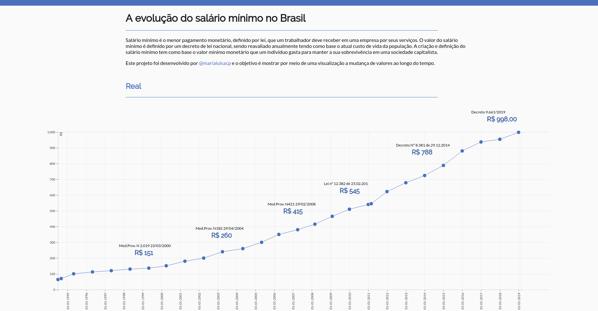
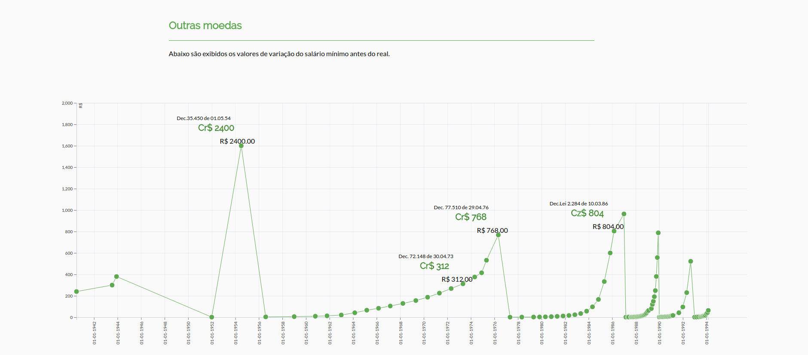

# Salário Mínimo no Brasil

Estou desenvolvendo um pequeno experimento com dados do salário mínimo no Brasil. O objetivo é colocar em prática algumas boas práticas de programação no desenvolvimento de visualização de dados com D3Js.

## Authors

* **[Maria Luísa Costa Pinto]** - (http://dcc.ufmg.br/~maria.luisa)
